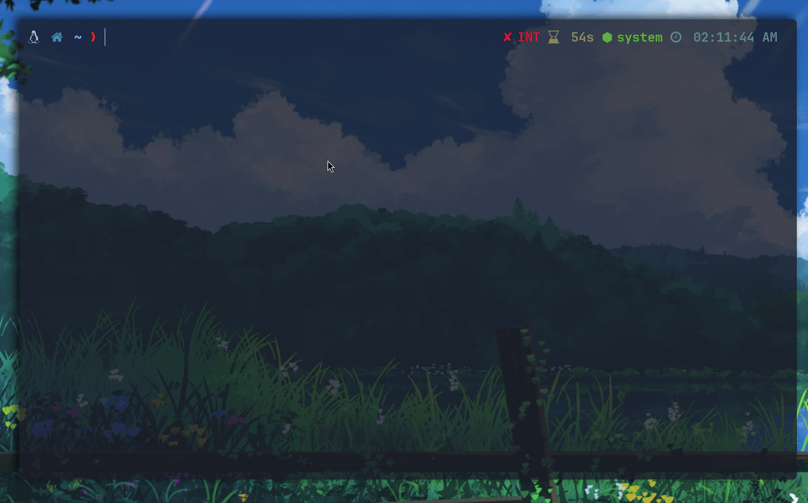

# Lezer
A Fast file-sharing app between Android and Linux.

## Progress
Throw a HTTP server, access it via IP address (2 machines should be connected to the same network).

- Visit `http://<IP>:<PORT>/browse` from the phone by scanning the QR code.
- Browse the files and choose one to download.

## Todo
- [X] What Android uses to share files (the fastest way).
    - [Wifi direct (P2P) connection](https://developer.android.com/develop/connectivity/wifi/wifi-direct)
- [X] How to share files between android and linux ?
    - Well the idea is easy, but idk how to achieve it. So far what I know is that we need to have a 
    1. Linux server that listens for incoming requests (uploads/downloads) 
    2. Some communication way for server to know and trust the clients maybe through a QR code.
    3. Sending files from linux to android (hmmm).
- [ ] Secure sharing ? (HTTPS)
- [ ] Fast sharing ? (relay, WebRTC, P2P)
- [ ] Create a hotspot and connect to.
